# Check Green - Front-End

O Check Green é uma aplicação desenvolvida como parte do projeto final da turma TRIP para o Módulo 3 do curso #FuturoDEV FMT. A aplicação tem como objetivo conectar viajantes que desejam compartilhar experiências de viagens sustentáveis, promovendo destinos eco-friendly.

## 🌍 Objetivo do Projeto

O projeto Check Green é um MVP que permite aos usuários (guias):
- Cadastrar e gerenciar destinos de viagens sustentáveis;
- Compartilhar suas experiências com outros viajantes exploradores;
- Utilizar uma visualização interativa via cards, lista, mapa e carrossel.

## ✨ Funcionalidades

- **Autenticação de Usuário:**  
  Cadastro e login para gerenciamento dos dados de viagem.

- **Validação Extra:**  
  Validação adicional para evitar duplicidade de CPF e e-mail ao realizar o cadastro.

- **Formulários:**  
  Possibilidade de adicionar, editar e excluir locais/destinos.

- **Validações com Zod e React Hook Form:**  
  Formulários seguros com validações robustas.

- **Modos de Visualização:**  
  - Cards dinâmicos com animação em CSS para melhorar a experiência do usuário; 
  - Lista dinâmica de destinos;
  - Mapa interativo utilizando a biblioteca Leaflet;
  - Carrossel com uso de modal para mais informações.

- **Integração com API Restful:**  
  As interações com o banco de dados PostgreSQL são realizadas a partir do projeto Back-End de uma API com Node.js e Express.

- **Integração com APIs:**  
  - ViaCEP para obtenção de dados de endereço;
  - AwesomeAPI para localização no mapa com coordenadas.

- **Design Responsivo:**  
  Interface adaptada para diferentes tamanhos de tela (mobile, tablet e desktop).


## 💻 Rodando o Projeto Localmente

### Passos para executar o projeto:

1. **Clone o repositório:**

    ```bash
    git clone https://github.com/FuturoDEV-Trip/M3P-FrontEnd-squad5.git
    ```

2. **Acesse a pasta do projeto:**

    ```bash
    cd M3P-FRONTEND-SQUAD5
    ```

3. **Instale as dependências:**

    ```bash
    npm install
    ```

4. **Inicie a API no Back-End na porta 3000:**

    ```bash
    npm run start:dev
    ```

5. **Inicie o servidor localmente:**

    ```bash
    npm run dev
    ```


## 📚 Bibliotecas Utilizadas

- **[React Router DOM](https://reactrouter.com/en/main):** gerenciamento de rotas.
- **[React Hook Form](https://react-hook-form.com/):** gerenciamento de formulários e validação.
- **[Zod](https://zod.dev/):** biblioteca para validação adicional de dados.
- **[Axios](https://axios-http.com/docs/intro):** gerenciamento de requisições HTTP para as APIs integradas.
- **[Lucide](https://lucide.dev/guide/packages/lucide-react):** biblioteca de ícones.
- **[Leaflet](https://react-leaflet.js.org/):** mapas interativos para a visualização dos destinos.

## 🛠️ Tecnologias

- **React** (com Vite para build e desenvolvimento rápido)
- **JavaScript**
- **CSS Modules** (para estilização isolada por componente)
- **API Restful** (projeto Back-End integrado ao Front-End para autenticação e banco de dados)

## 🎨 Paleta de Cores

| Cor             | Hexadecimal                                                 |
| --------------- | ------------------------------------------------------------ |
| Royal Blue      |  #586fdf |
| Azure           |  #007bff |
| Teal    |  #088284 |
| White Smoke   |  #F5F5F5 |

## 📸 Imagens de Exemplo

### Login

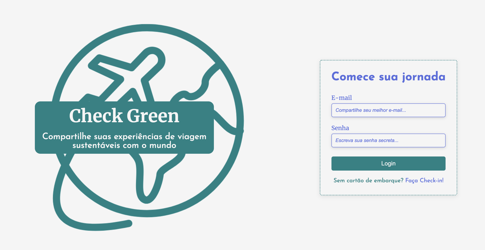

### Cadastro

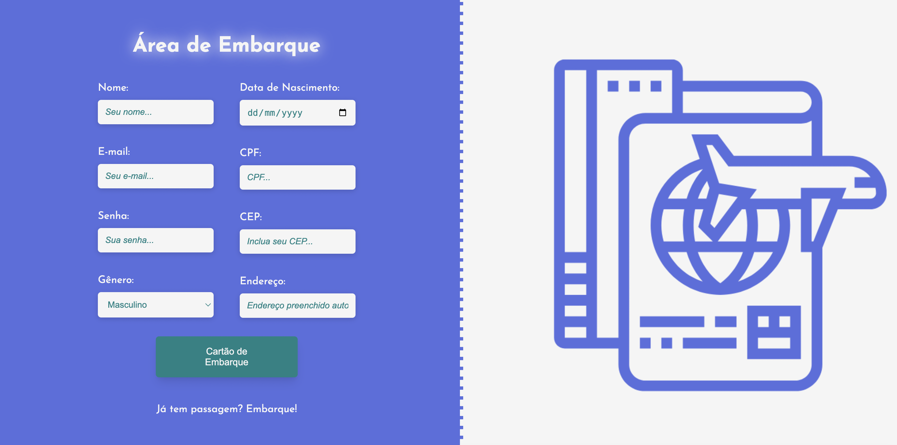

### Dashboard | Pré-Login

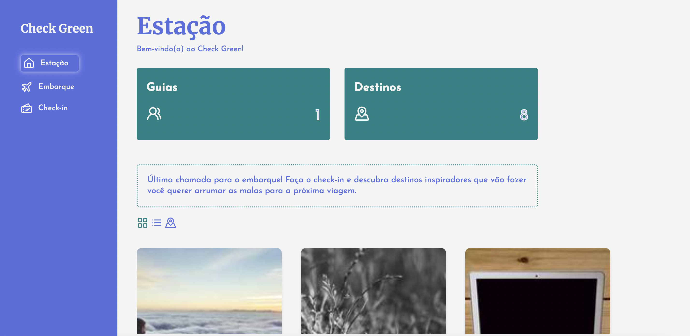

### Dashboard | Pós-Login

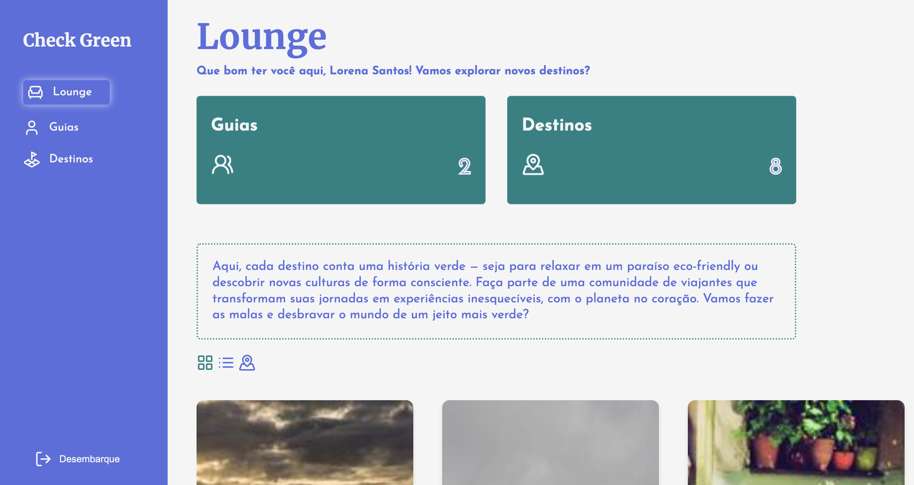

#### Cards

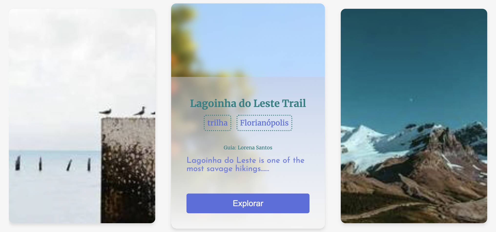

#### Lista de Destinos

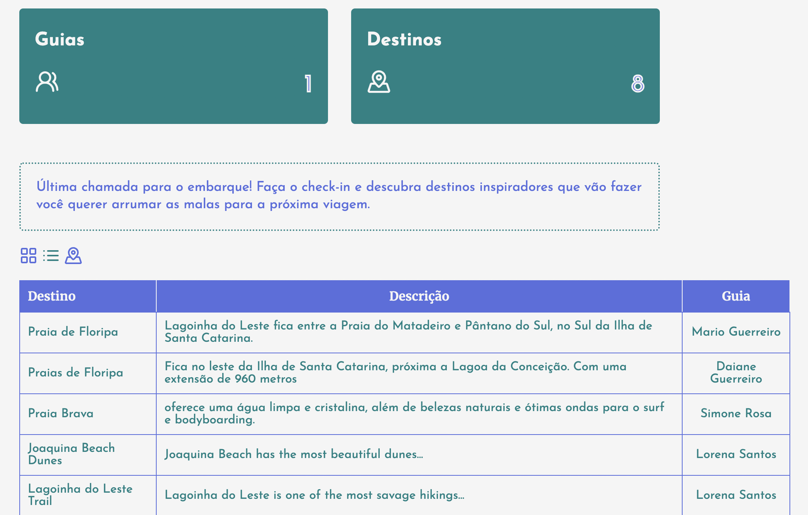

#### Mapa de Destinos

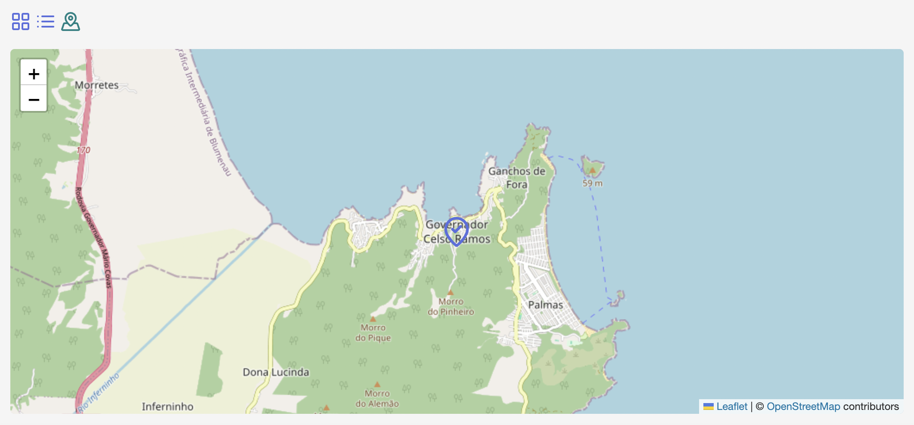

#### Carrossel com modal

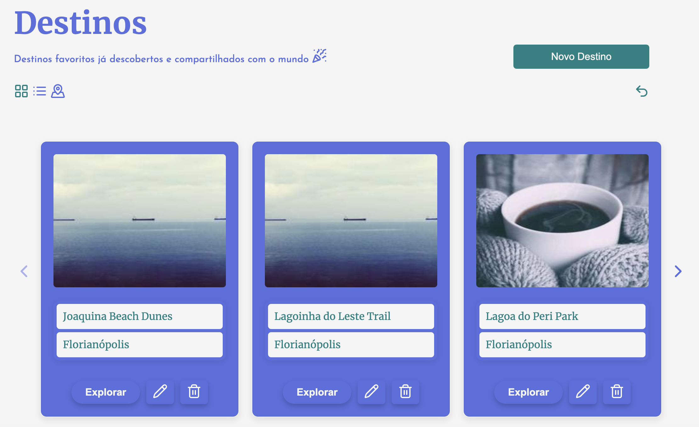
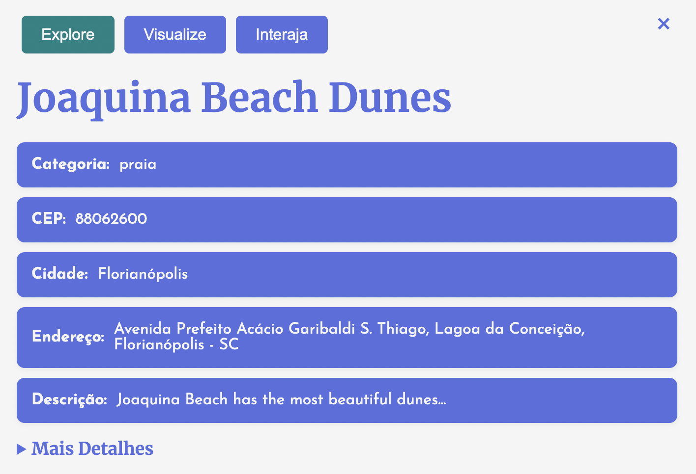

#### Formulários Destinos

##### Adicionar

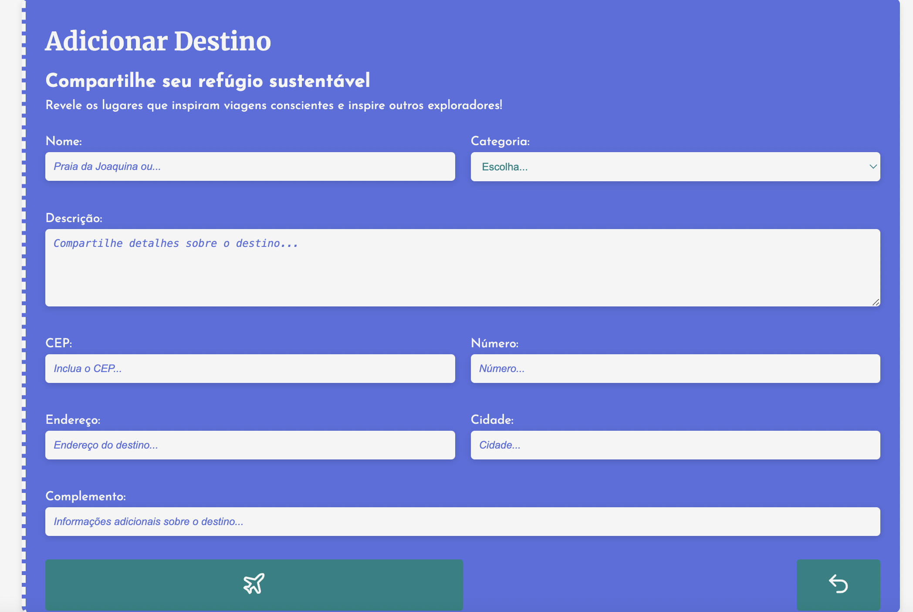

##### Editar

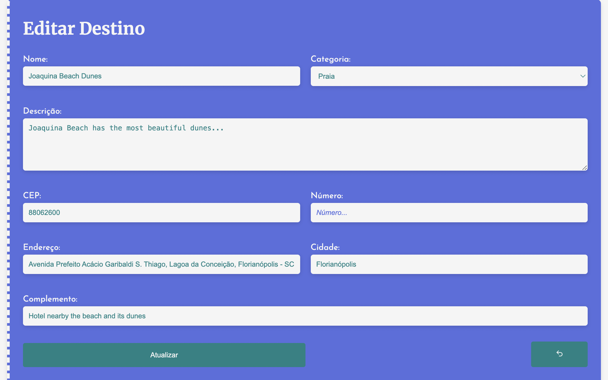

#### Gerenciamento de Usuários

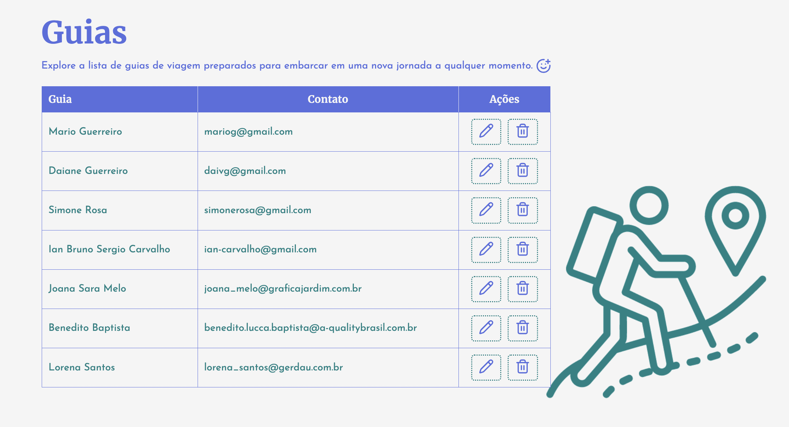

##### Editar

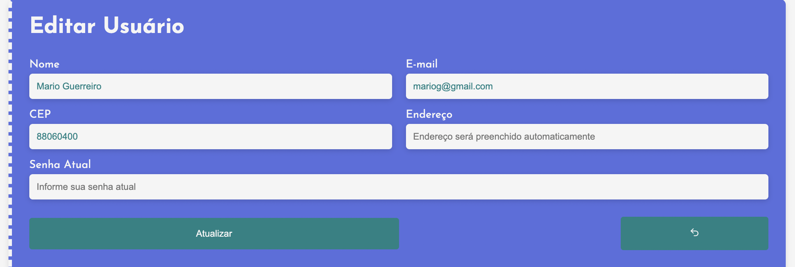

## 📋 Melhorias Futuras

- Upload de fotos dos locais;
- Filtros avançados para buscar destinos por características específicas (sustentabilidade, localização, etc.);
- Implementação do uso de tags;
- Campo de busca para pesquisas por palavra-chave;
- Páginas independentes e completas para cada destino;
- Paginação para melhor organizar as informações conforme o banco de dados cresce;
- Suporte a múltiplos idiomas;
- Sistema de gamificação;
- Versão como aplicativo.

## 👥 Equipe

**Time Check Green:**
- Julia Ribeiro
- Lucas Lino Martins
- Natália Cagnani
- Ricardo Guerreiro

## 🌐 Deploy

Quer embarcar nessa jornada com a gente? É só [clicar aqui](https://check-green-steel.vercel.app/) para explorar o projeto no ar e começar a planejar suas próximas viagens!

## 🔗 Contato

Tem alguma dúvida ou sugestão? Bora bater um papo! A tripulação da Check Green está aqui para te ajudar a planejar viagens mais sustentáveis. Mande sua mensagem para `apicheckgreen@gmail.com` e juntos vamos explorar novos destinos eco-friendly!

